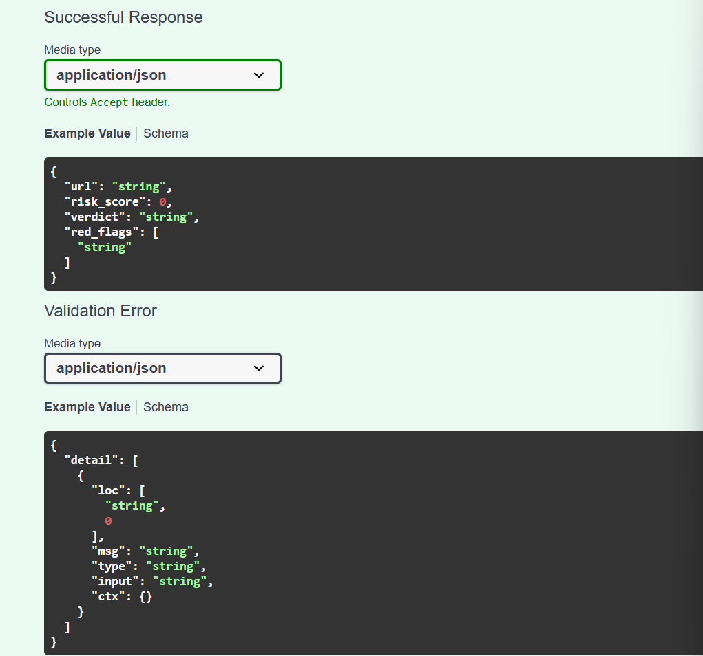

# Phishing URL Risk Scoring API

# Phishing URL Risk Scoring API

**Live demo:** ==> https://phishing-url-api-n0er.onrender.com (free tier, may take about 50 seconds to wake up)

REST API that scores...

## Tech
Python, FastAPI, scikit-learn (Random Forest), pytest, Docker, GitHub Actions

## Run locally
```
pip install -r requirements.txt
python train.py
uvicorn app.main:app --reload
```
Open http://127.0.0.1:8000/docs

## Example
Request:
```
POST /check-url
{"url": "http://192.168.4.7/secure-login/verify-account.php?id=1"}
```
Response:
```json
{
  "url": "http://192.168.4.7/secure-login/verify-account.php?id=1",
  "risk_score": 1,
  "verdict": "likely phishing",
  "red_flags": [
    "Uses an IP address instead of a domain name",
    "Does not use HTTPS",
    "Contains multiple sensitive words (login, verify, account...)"
  ]
}
```

## Endpoints
| Method | Path | Purpose |
|---|---|---|
| GET | /health | Service status |
| GET | /model-info | Training metrics |
| POST | /check-url | Risk score, verdict, red flags |

## SDLC
Requirements (REQUIREMENTS.md) → Design (feature-based model + REST API) → Implementation (feature branches + pull requests) → Testing (pytest + GitHub Actions CI) → Deployment (Docker) → Maintenance (CHANGELOG.md).

## Metrics and limitations
Accuracy 1.00 | Precision 1.00 | Recall 1.00 on a held-out 20% split of 6,000 synthetic URLs.

The model is trained on a synthetic URL dataset generated in `train.py`, so metrics are indicative only. To use real data, add `data/urls.csv` (columns: `url,label`, 1 = phishing) and re-run `python train.py`. It uses lexical features only, so it can miss phishing on hijacked legitimate domains.

